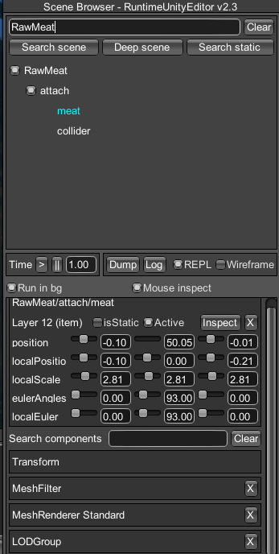
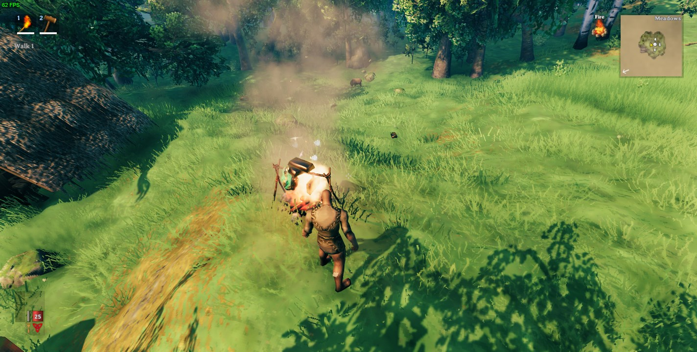

# Registering item conversions
_Item conversions_ in Valheim are anything are things that a player is able to place on a cooking station, and transform into a different item.  
Creation of custom item conversions is done through the [ObjectManager](xref:JotunnLib.Managers.ObjectManager) singleton class.

All item configs will always be loaded **after** all items are loaded. However, they will be loaded in the order that you call the `RegisterItemConversion` function.

**Note:** You **must** only use names of existing prefabs (either ones you created or default Valheim ones). This can be prefabs that have already been registered by another mod, or that already exist in the game. Here is a [list of availible prefabs](prefabs.md).

## Attach point
In order for your custom prefab to be displayed on the cooking station properly, it _must_ have its model placed under a child object called "attach", similar to how the "RawMeat" prefab works. Thus, your prefab GameObject hierarchy should look something like this:



If you are trying to add item conversions for prefabs already existing in-game, you would need to move all of the prefab's child objects into an "attach" object. For this, you can use the [PrefabUtils.NestChildrenUnderAttach](xref:JotunnLib.Utils.PrefabUtils.NestChildrenUnderAttach) utility function.

_WARNING: Be careful if modifying the structure of existing Valheim prefabs. Other mods may also be trying to modify them, and this could result in conflicts._

## Example
To create a new item conversion, you must first add a handler for the [ObjectRegister](xref:JotunnLib.Managers.ObjectManager.ObjectRegister) event

```cs
private void Awake()
{
    ObjectManager.Instance.ObjectRegister += initObjects;
}
```

then, create the handler. You can register custom items, recipes, and item conversions from this handler. To register custom item conversions, we can use the `RegisterItemConversion` function, and pass it a [ItemConversionConfig](xref:JotunnLib.Entities.ItemConversionConfig) object instance.

```cs
private void initObjects(object sender, EventArgs e)
{
    // Cooking station item conversions
    ObjectManager.Instance.RegisterItemConversion(new ItemConversionConfig()
    {
        // The prefab name of the cooking station (defaults to "piece_cookingstation" if not provided)
        CookingStation = "piece_cookingstation",

        // The amount of time it will take to cook the item
        CookTime = 5.0f,

        // The item placed on the cooking station
        FromItem = "CopperOre",

        // The item created after the time elapses
        ToItem = "Copper"
    });
}
```

That's it! Now, we can can place our copper ore on top of a cooking station rack in-game, and it will turn into copper bars!

